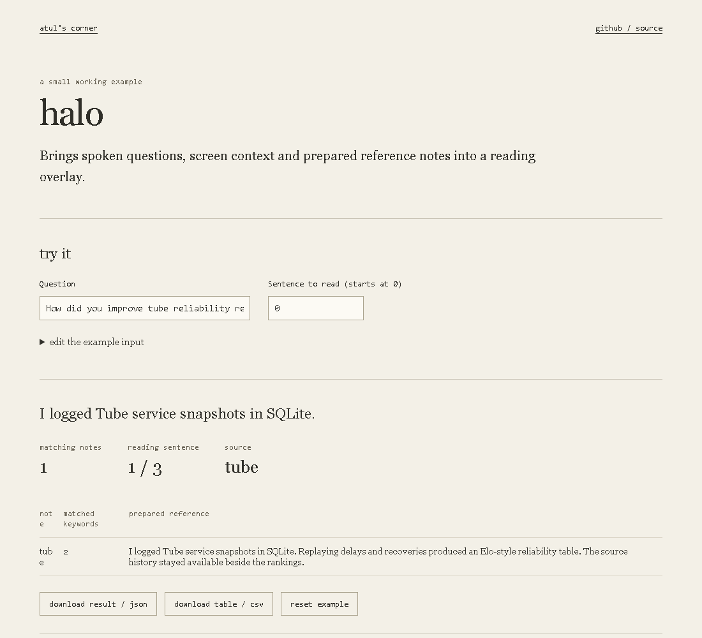
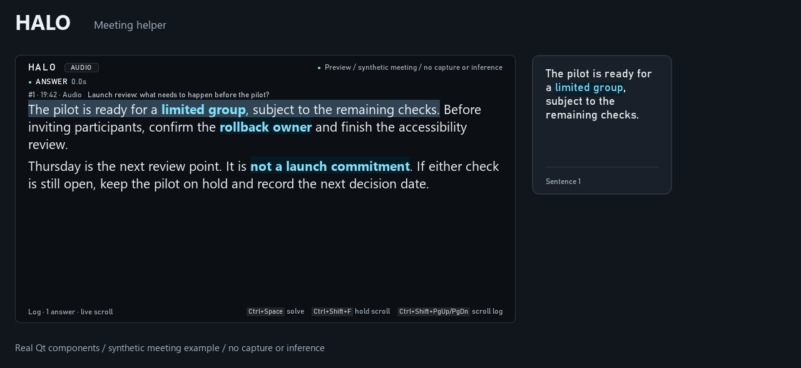
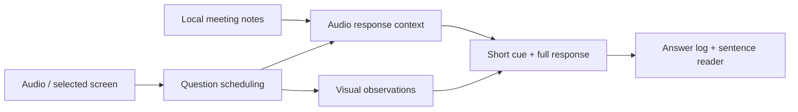

<!-- working-example:start -->
## Try it in a minute

**[Live example](https://lolstar123.github.io/halo/)** · [Example code](examples/portfolio/model.mjs) · [Run locally](examples/portfolio/README.md) · [Atul's website](https://atul-kanodia-fieldnotes.atulswaggalicious.chatgpt.site)

Ask a question against a small note pack; inspect retrieved evidence and step through a prepared cue.



<!-- working-example:end -->

# HALO

### A meeting helper that keeps the next sentence in view.

HALO combines spoken questions, local meeting notes and selected-screen context
with a compact Windows reading overlay. Keep the full response beside a sentence
reader, move through it with keyboard shortcuts, and return to earlier responses
without losing the current one.



*Real Qt components rendered offscreen. The example is synthetic; no meeting was recorded.*

## What it does

- **Audio:** transcribes the selected audio source and runs independent short-cue
  and full-response lanes. A slow response does not hold up the provisional cue.
- **Meeting notes:** loads a named local profile for audio responses. It does not
  search personal folders or invent missing decisions and commitments.
- **Screen context:** processes the selected capture region, carries bounded
  observations between related questions, and can request one detail crop.
- **Reading:** cyan keyword highlights, sentence navigation, answer history and
  click-through reading surfaces. Dock buttons work without activating HALO.
- **Recovery:** cancellation and question IDs prevent stale responses from
  replacing the current one; context survives supported connection recovery.

## Try the preview

Windows and Python 3.11+ are required for the desktop runtime.

```powershell
git clone https://github.com/LolStar123/halo.git
cd halo
python -m pip install -r requirements-dev.txt
python demo.py
```

The preview uses saved synthetic text. It makes no model calls and captures no
audio or screen content. Close it before launching the live application because
both use the same keyboard shortcuts.

To reproduce the image without displaying a window:

```powershell
$env:QT_QPA_PLATFORM = "offscreen"
python demo.py --snapshot docs/meeting-preview.png
```

## Live setup

The inference backend connects to a locally authenticated Codex app-server.
The model defaults reflect the development setup; model access is not bundled.
Set `brain_model` and `speed_model` in your local `config.json` to models your
account can use before running inference. The launcher and audio capture are
Windows-specific, and speech recognition may download model weights.

Place your notes in `profiles/<meeting-name>/context.md`; an example is in
[`examples/meeting-notes.md`](examples/meeting-notes.md). Local profiles and
configuration are gitignored.

```powershell
pythonw halo.py --meeting weekly-review --paused
```

Start paused, select the input and capture region, then resume from the dock.
Audio responses use the selected notes. Visual requests do not receive them.
Generated responses still need review. This build does not automatically produce
minutes or maintain an action register, and capture exclusion depends on the
screen-sharing path rather than providing universal protection.

## Inside the application



`engine.py` owns scheduling; `codex_transport.py` owns streaming and interruption.
`meeting_context.py` loads notes. `overlay.py`, `answer_log.py` and
`live_sentences.py` own the reading surfaces. `windowing.py` handles Windows
focus and capture behaviour.

## Verification

The public build passed **35 focused tests** on 15 September 2026, covering
answer history, capture configuration, visual memory and meeting-note isolation.

```powershell
$env:QT_QPA_PLATFORM = "offscreen"
python -m pytest tests -q
```

These tests use synthetic inputs and mocked inference. They do not establish
speech-recognition accuracy, live model quality or compatibility with every
screen-sharing provider. The next work is broader live meeting evaluation and
a simpler installation path.
