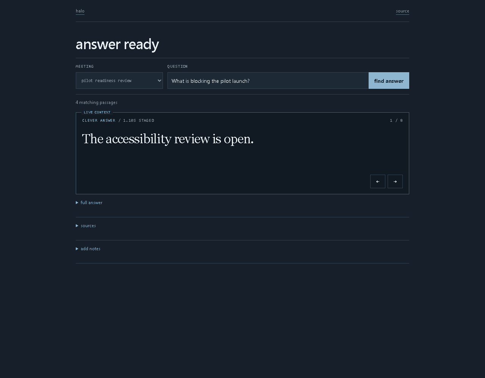

# HALO

A meeting workspace that keeps the current sentence, full answer and supporting notes visible together.

**[Open HALO](https://lolstar123.github.io/halo/)** · [Browser code](examples/portfolio) · [Public-build scope](PROVENANCE.md)



## Try the browser workspace

Choose one of four fictional packs: pilot readiness, incident review, trading research or project handoff. Each has three questions matched to its notes. Ask another question, paste notes or upload a `.txt` / `.md` file to change what the reader can find.

The browser ranks passages locally. **FAST ANSWER** shows the first matching passage; after a staged 1.10-second delay, **CLEVER ANSWER** joins up to three matches. These labels demonstrate the desktop reading flow. The browser makes no model call, records no audio and captures no screen.

- Read one sentence at a time with the arrow buttons or ← / → keys. Keyboard navigation pauses while typing or viewing a source.
- **Copy answer** copies the complete answer. **Open source** shows the original note; Escape closes it.
- An unmatched question produces an explicit empty state. The reader does not invent an answer.
- **Adjust the reading cue** changes the text and type size. Edited text is marked for checking against the notes.
- **Export notes** downloads the notes, current question and cue as Markdown.

Notes remain in the tab and are cleared on refresh. A session holds at most 12 notes and 500,000 characters; each pasted note is limited to 200,000 characters and each uploaded file to 250 KB. Retrieval returns at most five passages, and the question history keeps eight entries.

## Run the browser lab locally

Python 3 serves the static files. Node.js 20+ runs the model tests. No npm dependencies or model account are required.

```powershell
git clone https://github.com/LolStar123/halo.git
cd halo
python -m http.server 8000 --bind 127.0.0.1 --directory examples/portfolio
```

Open [localhost:8000](http://localhost:8000). Use HTTP rather than opening `index.html` directly. Stop the server with Ctrl+C.

```powershell
node --test examples/portfolio/model.test.mjs
```

Expected: three tests pass, covering all four packs, custom-note retrieval, unmatched queries and sentence splitting.

| Browser file | Responsibility |
|---|---|
| [`app.mjs`](examples/portfolio/app.mjs) | Pack selection, staged excerpts, sentence position, notes, copy and export |
| [`model.mjs`](examples/portfolio/model.mjs) | Passage splitting, term-based ranking and sentence segmentation |
| [`data/meetings.json`](examples/portfolio/data/meetings.json) | Four authored fictional meeting packs |
| [`style.css`](examples/portfolio/style.css) | Graphite/navy surfaces, reading layout and responsive behavior |
| [`tools/browser_audit.py`](tools/browser_audit.py) | Interaction, failure, keyboard and screenshot checks |

## Windows desktop application

The Python application combines audio questions, a selected screen region and local notes with a Qt reading overlay. Audio produces a focused answer after local endpoint detection. A manual visual solve can deliver a fast initial answer followed by a deeper pass. Answer IDs and cancellation prevent old responses from replacing the current one.

Windows and Python 3.11+ are required. Install the desktop dependencies and run the synthetic preview:

```powershell
python -m pip install -r requirements-dev.txt
python demo.py
```

The preview uses saved text. It makes no model calls and captures no audio or screen. Close it before starting the live application because they share keyboard shortcuts. For an offscreen image:

```powershell
$env:QT_QPA_PLATFORM = "offscreen"
python demo.py --snapshot docs/meeting-preview.png
```

The live inference transport uses a locally authenticated Codex app-server. Model access is not bundled. Set `brain_model` and `speed_model` in your local `config.json` to models available to your account. Speech recognition may download model weights.

Put notes in `profiles/<meeting-name>/context.md`; see [`examples/meeting-notes.md`](examples/meeting-notes.md). Configuration and local profiles are gitignored.

```powershell
pythonw halo.py --meeting weekly-review --paused
```

Start paused, choose the input and capture region, then resume from the dock. Audio answers use the selected meeting notes; visual requests do not receive them. Generated answers need review. This build does not create automatic minutes or maintain an action register. Capture exclusion depends on the sharing path.

| Desktop file | Responsibility |
|---|---|
| [`engine.py`](engine.py) | Scheduling, audio and visual response flow |
| [`codex_transport.py`](codex_transport.py) | Streaming inference, interruption and connection recovery |
| [`meeting_context.py`](meeting_context.py) | Selected local profile loading |
| [`overlay.py`](overlay.py), [`answer_log.py`](answer_log.py) | Reading surfaces and answer history |
| [`live_sentences.py`](live_sentences.py), [`sentence_reader.py`](sentence_reader.py) | Sentence delivery and navigation |
| [`windowing.py`](windowing.py) | Windows focus and capture behavior |

## Verification

```powershell
python -m pip install playwright
python -m playwright install chromium
python tools/browser_audit.py
```

The browser audit uses installed Chrome on Windows and Playwright Chromium elsewhere. It checks four packs, rapid prompt changes, custom notes, source inspection and Escape, unmatched queries, keyboard navigation, repeated copy, edited-cue persistence, rejected uploads, exports, fixture-load errors and reduced motion. It captures desktop and 390 px mobile views in `output/playwright/`; the desktop view also updates the screenshot above.

Desktop checks:

```powershell
$env:QT_QPA_PLATFORM = "offscreen"
python -m pytest tests -q
```

The 35 desktop tests cover answer history, capture configuration, visual memory and meeting-note isolation with synthetic inputs and mocked inference. They do not measure speech recognition, live model quality or every screen-sharing provider. Broader live meeting evaluation remains open.
